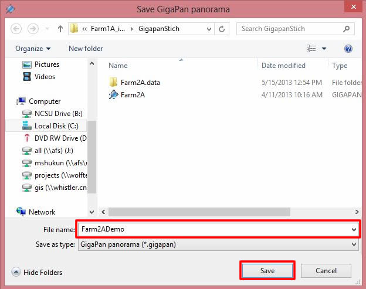
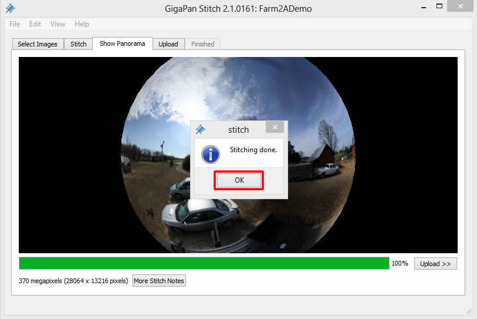
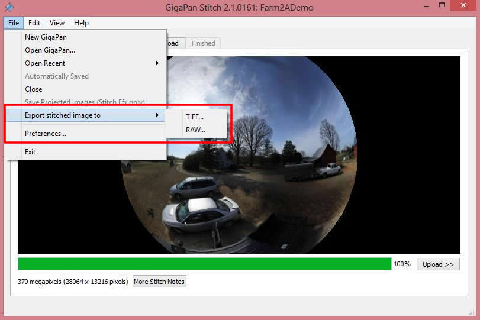
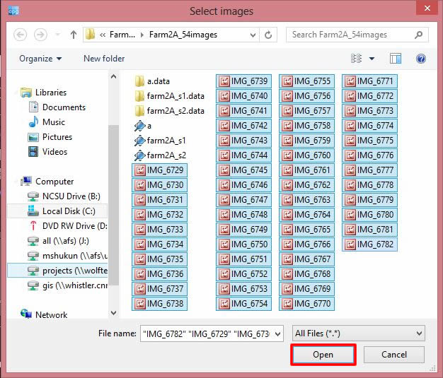

# 3. Preparing IVE Scenes

### Table of Contents

**[Introduction To Image Acquisition](#introduction-to-image-acquisition)**

**[Image Acquisition](#image-acquisition)**

&nbsp;&nbsp;&nbsp;&nbsp;[Physical Setup](#physical-setup) 
&nbsp;&nbsp;&nbsp;&nbsp;[Image Capture](#image-capture) 

**[Introduction To Stitching](#introduction-to-stitching)**

**[Stitching](#stitching)**

&nbsp;&nbsp;&nbsp;&nbsp;[Stitching Methods](#stitching-methods)  
&nbsp;&nbsp;&nbsp;&nbsp;[Protocol for GigaPan Stitch](#protocol-for-gigapan-stitch) 
&nbsp;&nbsp;&nbsp;&nbsp;&nbsp;&nbsp;&nbsp;&nbsp;*[Getting Started](#getting-started)* 
&nbsp;&nbsp;&nbsp;&nbsp;&nbsp;&nbsp;&nbsp;&nbsp;*[Stitching Images Using GigaPan Stitch.Efx](#stitching-images-using-gigapan-stitchefx)* 
&nbsp;&nbsp;&nbsp;&nbsp;&nbsp;&nbsp;&nbsp;&nbsp;*[Exporting a Panorama Image](#exporting-a-panorama-image)* 
&nbsp;&nbsp;&nbsp;&nbsp;&nbsp;&nbsp;&nbsp;&nbsp;*[Uploading Panorama Image to Gigapan.com](#uploading-panorama-image-to-gigapancom)* 
&nbsp;&nbsp;&nbsp;&nbsp;[Protocol for Autopano Giga 3.0](#protocol-for-autopano-giga-30) 
&nbsp;&nbsp;&nbsp;&nbsp;&nbsp;&nbsp;&nbsp;&nbsp;*[First Steps](#first-steps)* 
&nbsp;&nbsp;&nbsp;&nbsp;&nbsp;&nbsp;&nbsp;&nbsp;*[Creating Equirectangular Panorama](#creating-equirectangular-panorama)* 
&nbsp;&nbsp;&nbsp;&nbsp;&nbsp;&nbsp;&nbsp;&nbsp;*[Editing Your Panorama](#editing-your-panorama)* 
&nbsp;&nbsp;&nbsp;&nbsp;&nbsp;&nbsp;&nbsp;&nbsp;*[Saving Your Panorama](#saving-your-panorama)* 
&nbsp;&nbsp;&nbsp;&nbsp;&nbsp;&nbsp;&nbsp;&nbsp;*[Common stitching problem using Autopano Giga](#common-stitching-problem-using-autopano-giga)* 
&nbsp;&nbsp;&nbsp;&nbsp;[Autopano Video](#autopano-video) 
&nbsp;&nbsp;&nbsp;&nbsp;&nbsp;&nbsp;&nbsp;&nbsp;*[First Things to Know](#first-things-to-know)* 
&nbsp;&nbsp;&nbsp;&nbsp;&nbsp;&nbsp;&nbsp;&nbsp;*[Preparing and Synchronizing](#preparing-and-synchronizing)* 
&nbsp;&nbsp;&nbsp;&nbsp;&nbsp;&nbsp;&nbsp;&nbsp;*[Editing a Reference Panorama for Video Stitching](#editing-a-reference-panorama-for-video-stitching)* 
&nbsp;&nbsp;&nbsp;&nbsp;&nbsp;&nbsp;&nbsp;&nbsp;*[Rendering and Publishing 360° Videos](#rendering-and-publishing-360-videos)* 

**[Introduction To Manipulation](#introduction-to-manipulation)**

**[Manipulation](#manipulation)**  
&nbsp;&nbsp;&nbsp;&nbsp;[Methods of image manipulation for IVE using Adobe Photoshop CS](#method-of-image-manipulation-for-ive-using-adobe-photoshop-cs)  
&nbsp;&nbsp;&nbsp;&nbsp;&nbsp;&nbsp;&nbsp;&nbsp;*[Basics](#basics)* 
&nbsp;&nbsp;&nbsp;&nbsp;&nbsp;&nbsp;&nbsp;&nbsp;*[Adding a Building](#adding-a-building)* 
&nbsp;&nbsp;&nbsp;&nbsp;&nbsp;&nbsp;&nbsp;&nbsp;*[Adding Greenery](#adding-greenery)* 
&nbsp;&nbsp;&nbsp;&nbsp;&nbsp;&nbsp;&nbsp;&nbsp;*[Adding Trees](#adding-trees)* 
&nbsp;&nbsp;&nbsp;&nbsp;&nbsp;&nbsp;&nbsp;&nbsp;*[Adding Other Decorations (People, Shrubs, and Benches)](#adding-other-decorations-people-shrubs-and-benches)* 

**[Introduction to Cube Mapping and Cube Wrapping](#introduction-to-cube-mapping-and-cube-wrapping)**

**[Cube Mapping](#cube_mapping)**  

&nbsp;&nbsp;&nbsp;&nbsp;[Cube Mapping and Cube Wrapping](#cube-mapping-and-cube-wrapping) 
&nbsp;&nbsp;&nbsp;&nbsp;[Protocol For Pano2VR](#protocol-for-pano2vr) 

## Introduction To Image Acquisition
This section will explain how to acquire images using Gigapan Epic Pro Robot that will later be stitched to create a panorama.
### Physical Setup
#### Equipment to pack
* Tripod and carrying case.
*	GigaPan EPIC Pro, connecting cable, and backpack. Make sure the battery in the GigaPan and the extra battery are charged
* Canon DSLR and backpack. Pack an extra SD card and make sure the battery in the camera and the backup battery are full.
* Gigapan Epic Pro Parts

EPIC Pro Body:
  
* Camera Rail
* Rail Adjustment Knob
* Camera Mounting Platform
* Camera Mounting Plate
* Camera Mounting Plate Lever
* Navigation panel
* Tripod Mount
* Battery Chamber

Navigation Panel:
  
* LCD Display
* Cancel Button
* Power/OK Button
* Trigger cable port
* Remote trigger port
* Battery port

### Setup the Gigapan Epic Pro
* Set up the tripod.
* Unpack the Epic Pro.
*	Slide the Epic Pro into the tripod’s mount and wait for the click to ensure that it’s all the way in.
*	Tighten the screw on the right side of the tripod to lock the Epic Pro in.
*	Use the bubble level to center and level the EPIC Pro. Adjust the tripod legs and mount.
*	Press and hold the power button on the Epic Pro until it powers on.
*	Press the down button until you can highlight the Move Camera option, press OK.
*	Hold the down button until the camera rail is level or angled up slightly.
*	Rotate the locking pin to the unlocked position (parallel with the camera rail).
*	Place the camera in the mount and rotate the locking pin to the locked position.
*	Make sure the small silver pin is also locked.
*	Connect the cable between the camera and the Epic Pro.

### Setup your camera
  
* Make sure the Epic Pro is on.
* Scroll down and highlight Camera Setup, select OK.
* Select Set.
* Align the horizon with the top of the camera screen (using the viewfinder) at the prompt.
* Align the horizon with the bottom of the camera screen (again with the viewfinder) at the next prompt.
* The camera Field of View (FOV) should be around 40°.
* Power on the camera.
* Set the click-wheel setting to the P (Program AE) setting. This is one click above the Full Automatic Mode (green box) setting.
* Ensure that the stabilizer is ON. This setting is on the left side of the lens.
* Ensure that the auto-focus is ON. This setting is also on the left side of the lens, just above the stabilizer switch.
* Ensure that the zoom is locked in all the way. The lock is D-shaped and is located on the right side of the lens.
* To set the correct exposure settings, press the menu button on the back of the camera and scroll to the second camera settings box (red box). Scroll down to the White balance setting and select either Daylight, Shade, or Cloudy according to the current conditions. Select SET. Press the MENU button again to exit out of the menu screen.

###	Image Capture

* Take a picture of your hand or something noticeable to indicate the beginning of a new panorama.
* On the Epic Pro display, scroll down and highlight 360 Panorama.
* When prompted to Set camera’s zoom, select OK.
* When prompted to move the camera to the top of the image, use the Epic Pro controls to move the camera to the top of the panorama. This is about 60° on the wheels on either side of the Epic Pro’s arms. Press OK.
* Next, Use the Epic Pro controls to move the camera to the bottom of the panorama. This is about -60°. Press OK.
* When prompted to Show panorama, select NO.
* When prompted to Start panorama, select OK.
* It should take about 40 to 54 photos.
* Ensure that the camera takes EVERY photo as the Epic Pro pans it around. If it skips one, then one of the camera’s settings are off and you’ll need to start over.
* Finally, once the camera has taken all of the photos, take another picture of your hand or something noticeable to indicate the end of the panorama.

## Introduction To Stitching

This section deals with different applications in stitching images and videos as well as methods to manipulate stitched image in order to get desired environment for VR.

## Stitching

### Stitching Methods

Stitching means taking all captured photos and arranging them to be a single photo. Stitching includes three processes: removing distortions on the images, matching common features of the images, and finally straightening the horizon. These processes can be done automatically by applications that take images in and deliver final product or manually which gives the user more control over all processes and images or video quality. Some consumer cameras come with their own user friendly stitching software. Here, two automated image stitching, GigaPan Stich and autopano Giga 3.0, as well as Autopano video stitching software will be introduced.

### Protocol for GigaPan Stitch

#### Getting Started
* The camera mounted on the GigaPan EPIC Pro robot captures gigapixel panoramas and such captured images can number in the hundreds or even thousands. The GigaPan Stitch.Efx software manages images in the correct rows and columns and then stitches those images to create a panorama.
* For more information about GigaPan Stitch, click [*here.*] (http://www.omegabrandess.com/Gigapan)
* Documentations are available [*here*] (http://gigapan.com/cms/manuals/epic-pro-stitching-and-uploading-panoramas) and [*here.*] (http://www.gigapan.com/cms/manual/pdf/stitch-efx-upload-manual.pdf)

#### Stitching Images Using GigaPan Stitch.Efx
* Open GigaPan Stitch.Efx.
* Click **Add Images** and browse the images taken by the GigaPan EPIC Pro robot and select one or more images to add your panorama, then click **Open**.    
  
* Adjust **Number of Rows** for stitching images and click **Save** selection and Stitch button.  
&nbsp;&nbsp;&nbsp;&nbsp;The image below has not selected the appropriate **Number of Rows**.  
  
&nbsp;&nbsp;&nbsp;&nbsp;The appropriate **Number of Rows** is selected.  
  
* Type the file name and click *Save* button.  
  
* After stitching is completed, click the **OK** button at the bottom of **Stitching done** popup window.  
  

#### Exporting a Panorama Image
* Click **File** and select **Export** stitched image to, and then select **TIFF** or **RAW** image file format.  
  

#### Uploading Panorama Image to Gigapan.com
* Visit [*Gigapan.com*](http://gigapan.com/) and create log in ID if you don't have one.
* Click **Upload** tab or **Upload** button.  
  
* Fill in the fields and clock Upload now. The Gigapan image storage server will store your uploaded panorama image in 2D format.  
  

### Protocol for Autopano Giga 3.0

#### First Steps
* Autopano Giga 3.0 is an image stitching software, similar to GigaPan Stitch.Efx which allows users to control the stitching process in greater detail than GigaPan Stitch.Efx.
* Autopano Giga and Autopano Pro are products of Kolor. According to their [*website*] (http://www.kolor.com), Kolor is now the world reference in panoramic imagery solutions, including panorama software, virtual tour software, video-stitching software and a full range of hardware products.
* For more information about Autopano Giga 3.0 click [*here.*] (http://www.kolor.com/autopano/#start)
* Documentations are available [*here.*] (http://www.kolor.com/wiki-en/action/view/Autopano_Documentation)
* Watch My first panorama video tutorial [*here.*] (https://www.youtube.com/v/AsMQPGFdiiA?version=3&hl=fr_FR)
* Watch Autopano interface presentation video tutorial [*here.*] (https://www.youtube.com/v/RyFzAmP7nEo?version=3&hl=fr_FR&rel=0)

#### Creating Equirectangular Panorama
* Open Autopano Giga 3.0 *[C:\Program Files\Kolor\Autopano Giga 3.0]*.
* The Gigapan Interface toolbar is located at the top of the Autopano interface. On the interface toolbar click **Edit** and **Settings…**  
  
* Changes in the settings will be applied to all newly created projects. In the general settings window, Click **Panorama**. In the **Projection and crop** section select **Default projection:** Spherical and **Default crop:** Maximum projection range. Click **Ok**, and then close the settings window.  
  
* On the interface toolbar click **File** and then select **Import**.  
  
* Click **GigaPan** module and then click **Next**.  
  
* The Gigapan import module enables importing shots created with a Gigapan motorized panoramic head. On the **General** tab, go to the **Images** section and click the **…** button.  
  
* Browse the file where your images captured by GigaPan EPIC Pro and select one or more images for creating a panorama, and then click **Open**.  
  
* Autopano Giga normally adjusts the images’ rows and columns automatically. However, if for any reason the program does not adjust the rows and columns, you will need to adjust it manually. The number of rows and columns are associated with each other. The correct number of rows and columns can be found using GigaPan Stitch.Efx. The **Preview** section in the General tab settings enables visualization of the shooting. The preview alters according to the number of rows and columns. Reviews the final image to define imported images are placed in appropriate rows and columns.  
  
* On the import module, click on the **Shoot layout** tab. This tab enables the selecting the arrangement corresponding to the taken photos. Normally the Column (default) option is the most suitable option for images. Otherwise, make any necessary changes for your panorama. **DO NOT** click the **Finish** button yet.  
  
* Next, on the import module Click **Shoot setup** tab. Check the **Force 360° panorama** check box.  
  
* On the import module, click the **Stack** tab. On the **Detect Links in:** select **The reference level**. This option looks for the probability of links between images with the same bracket level. At the **For a stack:** option click **Detect control points**. This preference applies control points as reference for overlaying dissimilar images of the same stack. Make any necessary changes to your panorama.  
  
* Next, on the import module, click the **Detection** tab. The image below shows the default setting on the **Auto detection** option. This option enables the automatic launch of the detection after confirming the module’s settings. Make any necessary changes for your panorama, and click **Finish**.  
  
* Wait until Keypoint matching is finished. Waiting time may vary by number and size of images. After completing Keypoint matching, you will see the preview of your panorama image in the panorama window group, located at the right of the main window.  
  
&nbsp;&nbsp;&nbsp;&nbsp;The Panorama window also describes the technical specifications of the resulting image in the Panorama Information section. In this frame make sure **FOV** (Field of View) settings to be 360.00 X 180.00, and the projection mode adjusted to the **Spherical** projection option.  
  
&nbsp;&nbsp;&nbsp;&nbsp;The panorama interface toolbar offers access functions such as Panorama editor, rendering, and saving the project. If you require checking the stitching quality of the panorama image, click the **Edit** button. The panorama editor interface window will open. The Information window is located at the left side of the window, which displays the **Stitching quality** of the panorama. In general, RMS lower that 5 is considered as a Good quality link. See [*here.*] (http://www.kolor.com/wiki-en/action/view/Autopano_Giga_-_Panorama_Editor_-_Control_Points_Editor?action=view&title=Autopano_Giga_-_Panorama_Editor_-_Control_Points_Editor) If you require editing your panorama, see **Editing your panorama** section.  
  
* At the Panorama window click **Render**. This button initiates the Rendering launcher window that enables you to export your panorama.  
  
* In the Rendering window choose the output parameters and make any necessary changes for the Render settings. In the case of this example, **Output** size is minimized to 10% of full size panorama. It is strongly recommended resizing if your panorama size is large.
In the case of this example, Output size is minimized to 10% of full size panorama. It is strongly recommended resizing if your panorama size is large. Do you need to Photoshop your panorama image? Keep your panorama pixel dimension smaller than 300,000 x 300,000. Photoshop does not support over 300,000 x 300,000 pixels per image.  
  
&nbsp;&nbsp;&nbsp;&nbsp;At the Rendering window click **Render** so that the Batch render window will be launched. Wait until rendering is completed. The output image will be saved and located in the defined output file modifications of the Rendering window.  
  
&nbsp;&nbsp;&nbsp;&nbsp;Find Equirectangular panorama in your files.  
  

#### Editing Your Panorama
* Learn how to edit the panorama: 
&nbsp;&nbsp;&nbsp;&nbsp;Watch control points editor presentation video tutorial [*here.*](https://www.youtube.com/v/YQ8PUgtP-vw?version=3&hl=fr_FR) 
&nbsp;&nbsp;&nbsp;&nbsp;Watch using the control points video tutorial [*here.*](https://www.youtube.com/v/K26Ki4hYqQg?version=3&hl=fr_FR) 
&nbsp;&nbsp;&nbsp;&nbsp;Find Autopano Giga Documentation [*here.*](http://www.kolor.com/wiki-en/action/view/Autopano_Giga_2.5_Documentation?action=view&title=Autopano_Giga_2.5_Documentation) 
* In the main panorama window toolbar click **Edit**. The panorama editor window will open. This window enables shape, color, and crop correction of the panorama.  
  
&nbsp;&nbsp;&nbsp;&nbsp;It will open a new window.  
  
* At the panorama editor window toolbar click **Ctrl points editor**. This options allows manual correction of links and control points to acquire an ideal placement of images. The active control point editor interface opens windows: **The Panorama Editor** window, and **The Control Points Editor** window.  
  
&nbsp;&nbsp;&nbsp;&nbsp;The Panorama Editor window displays a mesh that demonstrates the links between images and their quality. The mesh enables selecting images and links. The Control points editing area has 2 windows where two selected images from the list can be observed and edited with the available tools.  
  
* Edit panorama as needed. For editing, please refer the Autopano Giga Documentation and tutorial videos, to which you can find web links in step 1 above.

#### Saving Your Panorama
* There are two ways to save your project: 
**1)** Save workspace (both Group windows and Panorama windows) 
&nbsp;&nbsp;&nbsp;&nbsp; a. Click **File** and **Save workspace**. 
&nbsp;&nbsp;&nbsp;&nbsp; b. Enter your Autopano workspace (.apw) file name in **File name** space and click **Save**. It will open a new window to save Panorama windows. Enter your Autopano (.pano) file name in **File name** space and click **Save**.  
**2)** Save project (only save Panorama windows) 
&nbsp;&nbsp;&nbsp;&nbsp; a. Click **Save project** button in **Panorama windows** to save the project. 
&nbsp;&nbsp;&nbsp;&nbsp; b. Enter your Autopano(.pano) file name in **File name** space and click **Save**.

#### Common stitching problem using Autopano Giga
* Stitched panoramas potentially have black spots where stitching was not successful, as shown in Example image 1. This is caused by either/both insufficient overlap images and/or control points for stitching images (see Example image 2). This black spot oftentimes appears on the sky as shown below image.  It is due to not having enough control points for stitching.  In this case, you will need to modify image using photo editing software such as Photoshop.  Note that it seems this problem does not apply for using GigaPan Stitch.Efx. GigaPan stitich.Efx applies a Mercator projection instead of a spherical/Equirectangular projection.  
&nbsp;&nbsp;&nbsp;&nbsp; **Example image 1:** Black spots in the panorama.  
  
&nbsp;&nbsp;&nbsp;&nbsp; **Example image 2:** No control points on the sky in panorama.  
  

### Autopano Video

#### First Things to Know
* Autopano Video is the new video-stitching software application also developed by Kolor. It lets you assemble several videos into a single one covering up to 360 x 180 degrees. Unique feature: Intelligent GoPro Importer.
* For more information about Autopano Video click [*here.*](http://www.kolor.com/wiki-en/action/view/Autopano_Video_-_Workflow)
* Documentation is available [*here.*](http://www.kolor.com/wiki-en/action/view/Autopano_Video_Documentation?action=view&title=Autopano_Video_Documentation)
* Watch My first 360° video tutorial [*here.*](https://www.youtube.com/v/oggjzsQsjF4?version=3&hl=fr_FR)
* Watch Autopano Video presentation video tutorial [*here.*](https://www.youtube.com/watch?v=2Zi5m_cMiGk)
* Review supported file format in input [*here.*](http://www.kolor.com/wiki-en/action/view/Autopano_Video_-_Advanced_processing_with_Blender_and_After_Effects?action=view&title=Autopano_Video_-_Advanced_processing_with_Blender_and_After_Effects)
* Review advance processing with Blender and After Effects [*here.*](http://www.kolor.com/wiki-en/action/view/Autopano_Video_-_Advanced_processing_with_Blender_and_After_Effects?action=view&title=Autopano_Video_-_Advanced_processing_with_Blender_and_After_Effects)
* Review Main Window

#### Preparing and Synchronizing
When shooting the video, try avoiding putting your interesting content outside the overlapping areas. There are two different ways for synchronization: Audio or Motion. For Audio synchronization make a **clap** or click the **clicker** when cameras are recording. For Motion synchronization turn the rig around its center, not too fast, while holding it with arms or tripod. You can import your videos in two different ways: manually or using the wizard import. Place all your associated videos in the same folder.
* From the main menu select **File: Import videos**. Simultaneously select the six videos that you want them to be stitched. One other method is selecting and dragging your six videos in the Autopano video page, in the **Input videos** windows: **Drag’n’drop videos here**.  
  
&nbsp;&nbsp;&nbsp;&nbsp;Now you can see all six videos in the **Input videos** window.  
  
* The video stitching is based on stitching images in a precise moment in different videos. Below the **Input video** window there is the main timeline tool that can identify the appropriate instant for synchronization. Click the play button. You can simultaneously play the videos and identify a certain moment appropriate for synchronization. A clap sync or loud sound at the beginning of each video shot helps find the same wave form in each of the 6 cameras.  
  
&nbsp;&nbsp;&nbsp;&nbsp;When that point is identified, click pause. Now click the other button next to the play. This process will identify your synching moment in the video.  
  
* Then click the **Synchronization** under the videos. In the synchronization window set the **Maximum search range** to a larger value than the time required to start all the cameras. Then click **Use audio to synchronize**. When synchronization is done it shows **Accurate synchronization found**, if not try to recalculate the synchronization at a different instant. When synching has been finished click **Apply**, and then **Ok**. The Synchronization menu will be automatically closed.  
  
* After this step, choose a moment in the timeline that represents the best for the video as a whole. Avoid choosing moments when you are passing a door, or moving. If you choose such moments, the reference stitching will have parallax problems associated with this precise position. Once the videos have been synchronized click the **Stitch as…** button to create a reference panorama using the stills from the current moment in the timeline. If you have used the HERO3 cameras, choose the Stitch as **GO Pro**. Wait until the program has processed the stitching, regarding the process status at the bottom of the page. The still images are generated as .TIFF and extracted in your video folder.  
  
* Now you will notice a small thumbnail at the **Reference Panoramas** menu. Every time you stitch with a different setting, a new reference panorama is created. When you click at this reference, you can see the **Real-time preview** image at the right side of the page.  
  

#### Editing a Reference Panorama for Video Stitching
* At the Reference Panoramas menu click **Edit** for switching into Autopano.  
  
* Through clicking the **Edit** button in the Autopano page, a new page will open. Use Autopano for editing the colors, links, projection, or blending presents. Review [*this*](http://www.kolor.com/wiki-en/action/view/Autopano_Video_-_How_to_fix_the_foreground?action=view&title=Autopano_Video_-_How_to_fix_the_foreground) tutorial about improving automatic stitching with Autopano Video. Through editing and modifying this image, the still image associated with the video is modified. Check the links between images and adjust them if not correct. At the top of the page click **Edit Points** to open the **CP editor** page.  
  
* At the left corner of the CP editor page you can observe how each of the six images is stitched with other images. When you go to the **Link** menu, click a link instance. Now you can observe how two images are linked within an **automatic** stitching process. At this level, some images may not have any other images linked to them. It is best to link each image to at least 3 to 4 other images.  
  
* To modify and link images, click on an image. While holding the **ctrl** key, click on another image that has similar points to be linked.  
  
* At the top menu, click the **Add auto control points** button. This tool locates automatic points based on two manually selected areas that you think they are matched.  
  
* Select the matching area at the left image.  
  
* Now select the matching area within the right image.  
  
* You will notice that the program will automatically create linking points based on the selected areas. Also, at the left corner of the CP editor, there is a new line showing the two images are linked.  
  
* Repeat these steps until you have linked at least three images to each image.  
  
* Now that you have defined links for your images, go to the main menu of the CP editor and click **Optimization Settings**.  
  
* From the optimization presents menu select **Strong**. Then for **Focal calculation** select **Force identic**, for **Distortion calculation** select **Force different**, and for **Distortion model** choose **3rd order + optical axis center**. Then click **OK**.  
  
* At the main menu of CP editor click **Optimize panorama**.  
  
* After this process has been completed, check the original pano image (the page where you clicked the point editor). You can notice the panorama has been modified. At this example, you notice that there needs to be some more linkage between the images to make the pano more accurate. Go back to your **points editor** menu again and try to create more linkage.  
  
* At the main menu of the pano editor click **Move**. At the left side you see you can either move or rotate the pano or each of the six images.  
  
* This panel allows manual moving or rotating each of the images for a better configuration.  
  
* When you are satisfied with your stitching, save your .pano file. Click **Save** at the **Files** menu. This file can be reused as a reference in your film.  
  

#### Rendering and Publishing 360° Videos
* Switch to the Autopano video to validate your reference panorama at different instants. If it requires more modifications click the **Edit** button and apply necessary changes. At the bottom of the Realtime preview, click **Render**.  
  
* The **Render** panel will open. By default, the rendered video is saved as an mp4 file with up to 4K resolution. In the Render settings, you can select the video quality of your final video. Set the file destination or name.  
  
* Switch to the **Panorama** tab. In the Blending presets you can select **Smooth** for fast moving content. Use the **Sharp mask** for slow moving content.  
  
* Download the Kolor Eyes for Desktop from [*here.*] (http://www.kolor.com/kolor-eyes/#desktop) This application enables you to play your 360 videos at full resolution. Drag your final rendered video inside the Kolor page.  
  
* Now, you can move, zoom, and explore your 360° degree video in the Kolor Eyes program.  
  

## Introduction To Manipulation

If the equirectangular image is flawed and needs to be edited or certain visuals need to be added, the image can be manipulated.

## Manipulation

In this section, we learn how to manipulate objects in the equirectangular image.

### Methods of image manipulation for IVE using Adobe Photoshop CS

#### Basics
* **Open** the [*equirectangular*] (Manipulation_Participants.psd) image in Adobe Photoshop CS.
* **Open** the [*reference grid file*] (/images/Manipulation/Reference.png) and overlay it on the base image. Make sure that the grid is perfectly aligned with the base image. Let us name this layer **_perspective grid_**.  
  
* To separate the sky from the content for an easier manipulation, **Select** the sky (e.g. using the magic wand) and create a new layer (call it Sky). Then, turn off this layer. Note that advanced users may skip this step or use alternative strategies (e.g. masking).  
  

#### Adding a Building
* **Open** the [*buildings file*] (buildings.psd), bring in the Dome layer into the scene, and make sure that the dome is ordered behind all layers.
* Check if the dome is on the left side between the bricked and glass façade buildings.  
  
* **Turn on** the reference grid, and **select** the dome layer.  
* **Transform** the dome using warp to align the building’s horizontal elements with the corresponding grid line. Make Sky layer visible.  
  
* In the next step, we will use a [*plan*] (/images/Manipulation/plan.jpg)  related to tentative landscape design for the plaza to use as a reference for manipulation. For drawing the plan information in the equirectangular image, we first need to locate the approximate location of each greenery patch based on the corresponding pavements and/or street grids. Then, we should transform the geometry of a realistic representation of desired patches by following the extension lines of the reference grid. Note that the grid overlaid on the plan only projects the approximate shape of patches and the location of each feature needs to be determined by referring to the plan.

#### Adding Greenery
* Expand the **_Grass_** group, find the layer **_Sample_Grass_** and make the layer visible. Make sure that the reference grid is still visible and is on top of all layers.  
* Let’s start by drawing the patch **A** indicated in the design plan by moving the sample grass to the corresponding location. Reference grid can guide you to approximate the location.  
  
* Transform the layer until it matches the corresponding location. The warp and distort are suitable tools for transforming the layers.   
  
* Repeat the procedure for patch **B**. Patch B is farther from the observer compared to patch A, so before transformation, the sample grass should be scaled down to generate a finer grass texture.  
  
* Repeat the procedure for the rest of the patches. You can verify your manipulation accuracy by turning on the pre-made grass patches available in the grass group (eg. Grass_C, Grass_D). Once all the patches are transferred from the patches, turn of the reference grid. The final product should be similar to this [*image.*](/images/Manipulation/Figure_8.jpg)

#### Adding Trees
* Now let’s plant the trees based on your preferred arrangement. The horizontal lines above the ground should be utilized to estimate the height of trees as they get farther from the observer point. For instance, tree A and L are the same height. Tree A is erected 6 modules above the surface and the horizontal line that intersects the peak, also intersects with the tree L’s peak.  

* The final product could be similar to this [*image.*] (/images/Manipulation/Figure_10.jpg)

#### Adding Other Decorations (People, shrubs, and benches)
* Similar workflow applies for people, shrubs, and the furniture. Some cutouts of people (people_1, 2, 3), shrubs (Shrub_1, 2) and sample benches (Bench_C and Bench K) are included in the Photoshop file.  You will note that the benches don’t align with the reference grid, unless they are placed in specific locations that exactly match their orientation. This limitation applies to most of the object that their perceived geometry changes based on their orientation. A sample of the finished manipulation is shown [*here.*] (/images/Manipulation/Figure_11.jpg)

## Introduction to Cube Mapping and Cube Wrapping

First, we need to know what equirectangular projection is. This method projects lines of longitude to vertical lines and circles of latitude to horizontal lines. A standard world map is a good example of equirectangular projection which maps a sphere onto orthogonal coordinates. Cube mapping or cube map projection is another way of mapping that uses cube’s six faces as the map shape. In this method, each square side of the cube represents part of the projected environment. Cube maps are easy to project and their pixels are well-distributed.  

## Cube mapping

**Protocol for Pano2VR:**
**Getting Started**

  Pano2VR is an application to convert spherical or cylindrical panoramic images into Adobe Flash 10, HTML5 (WebGL/iPhone/iPad), or QuickTime VR (QTVR) with feature such as customizable skins, multiresolution (gigapixel panoramas), hotspots and directional sound) --- Pano2VR
  	More information about Pano2VR at:
http://gardengnomesoftware.com/pano2vr.php
  Documentations are available at:
    http://gardengnomesoftware.com/wiki/Main_Page
  Watch tutorials at:
    http://gardengnomesoftware.com/tutorial.php

**Creating six cube images from equirectangular panorama:**

* Open Pano2VR 4.5.1 – 64bit program.
* Click Select Input.  
  
* In the Input window, select input eye to Equirectangular, then click Open. Browse your Equirectangular panorama and click OK.  
  
* Click Convert Input.  
  
* In the Convert Panorama dialog box, adjust the Format settings as shown below. The Cube Face Size setting can be varied depending upon your method of display. For showing images via the Oculus HMD (DK1 and DK2), 1024 should be sufficient. As a rule, it is generally better to use a smaller size. Click Select button to select output file location and output file name. Finally, click Convert button.  
  
* Find your six cube face images.  
  

If going on to create VEs for viewing in the Oculus HMD:

* You will have to rename the image files for them to be read by the Python code. Rename the files following the pattern below.  
  
* Now you can place the 6 cube face image files into a new folder, name the folder: " ENV ". Be sure to place the ENV folder in the same location as IVE_template.py

* Once image files are in ENV folder open the python script and run

Example file locations  
  
